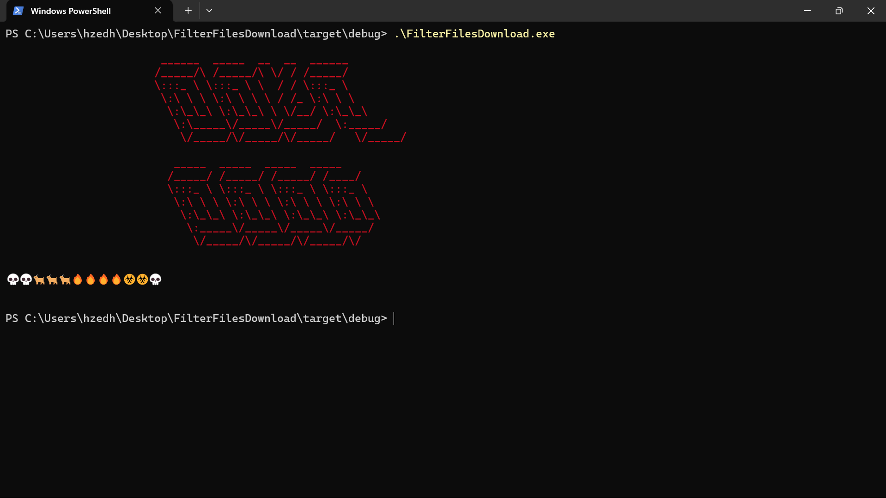

# FilterFilesDownload

It's a project to filter your files download (image, music, movies, pdf, folder ect) and to sort them by day of download.

The project it write in Rust and the program work in Windows.

